# nginx-lens

**nginx-lens** — современный CLI-инструмент для анализа, диагностики и визуализации конфигураций Nginx.

## Зачем нужен nginx-lens?

- Быстро находит ошибки и потенциальные проблемы в ваших nginx-конфигах.
- Визуализирует маршруты и структуру — легко понять, как устроен ваш nginx.
- Показывает, какой location/server обслуживает конкретный URL.
- Анализирует логи и помогает выявить аномалии.
- Упрощает аудит, миграцию и поддержку сложных инфраструктур.

## Примеры работы

### Справочник утилиты

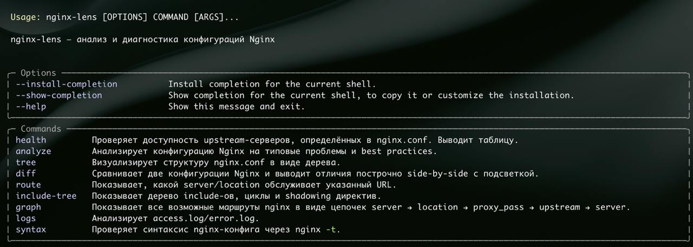

### Справочник для команд

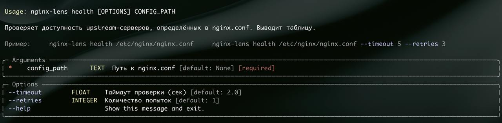

### Доступность upstream-серверов

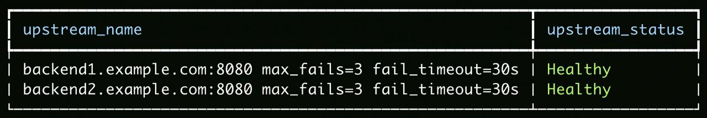

### Древовидная визуализация структуры конфига

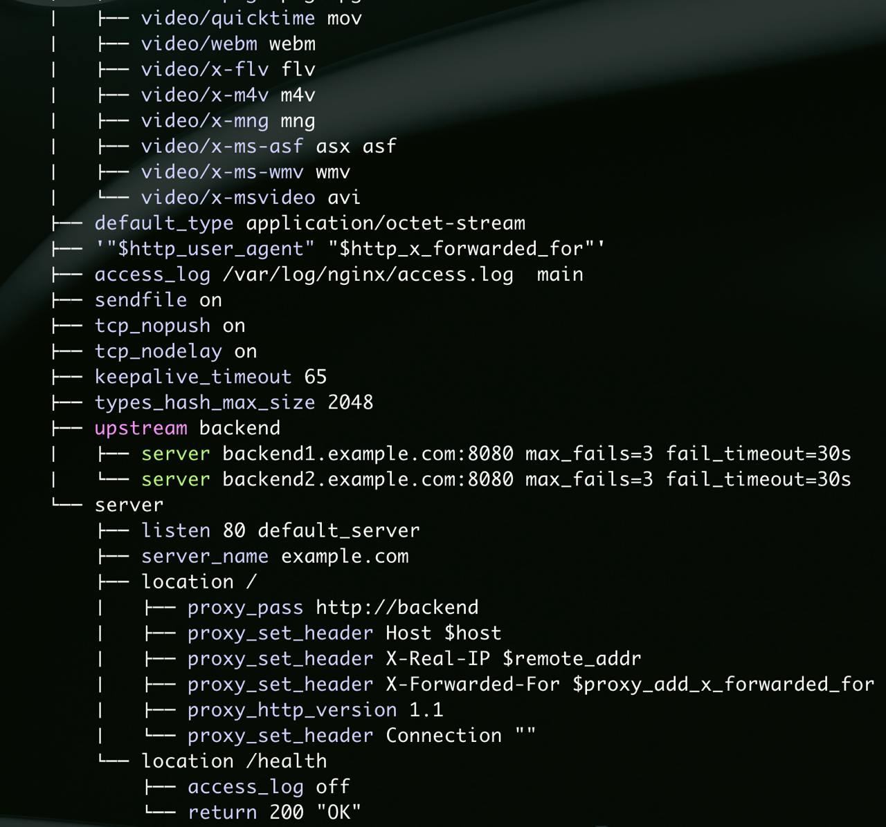

### Древовидная визуализация include'ов

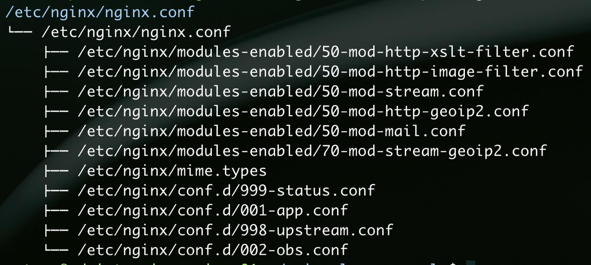

### Удобный анализатор логов

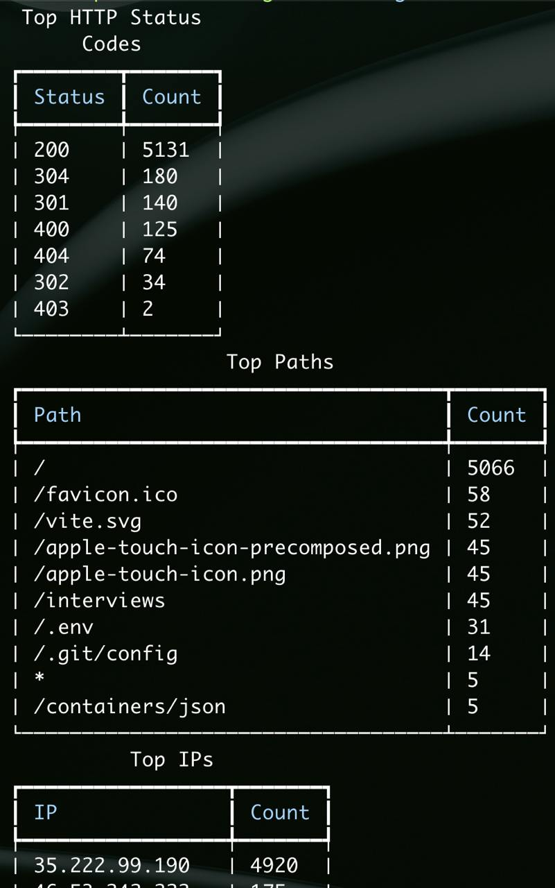

### Аудит конфигурации

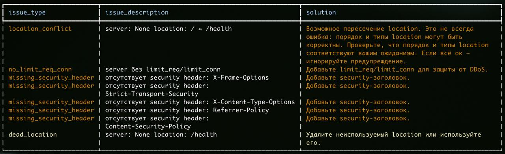

### Визуализация маршрутов

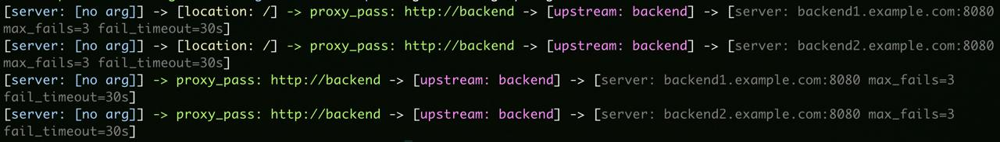

### Поиск маршрута для URL

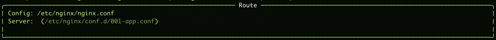

### Сравнение конфигов

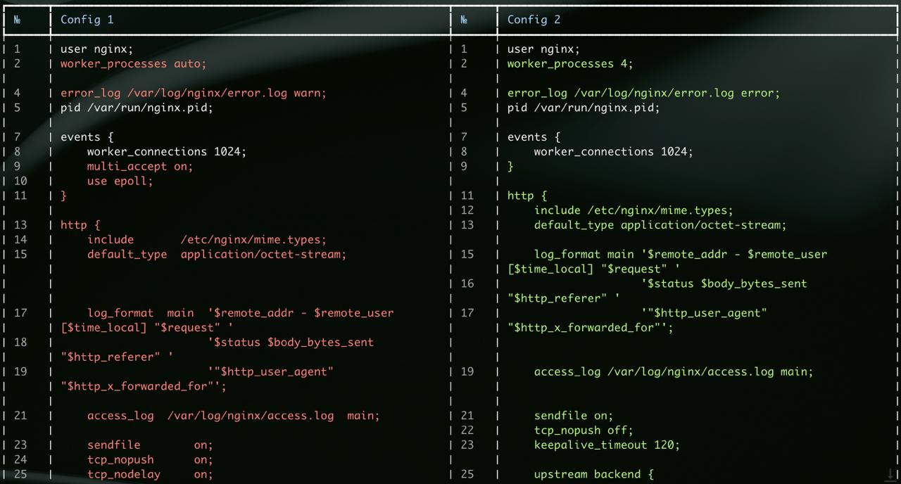

### Удобная проверка синтаксиса конфига

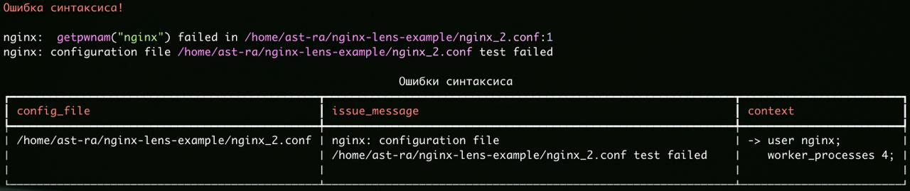


## Установка и системные требования

- **Python 3.8+**
- Linux/macOS (работает и под Windows WSL)

### Установка с помощью bash-скрипта (Рекомендуется)

```bash
wget https://raw.githubusercontent.com/shelovesuastra/nginx-lens/install-nginx-lens.sh
# или
curl https://raw.githubusercontent.com/shelovesuastra/nginx-lens/install-nginx-lens.sh

chmod +x install-nginx-lens.sh

./install-nginx-lens.sh
# или
sh ./install-nginx-lens.sh
# или
bash ./install-nginx-lens.sh
```

### Установка через PyPI

```bash
pipx install nginx-lens
```
или
```bash
pip install nginx-lens
```

## Автор

[Daniil Astrouski](https://github.com/shelovesuastra)

## Лицензия

MIT